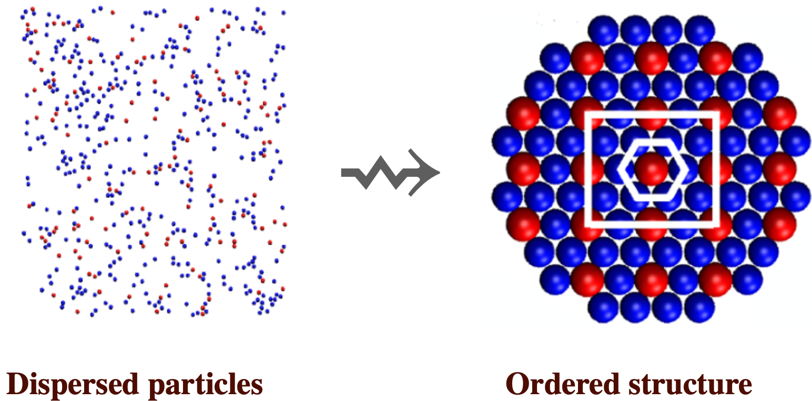
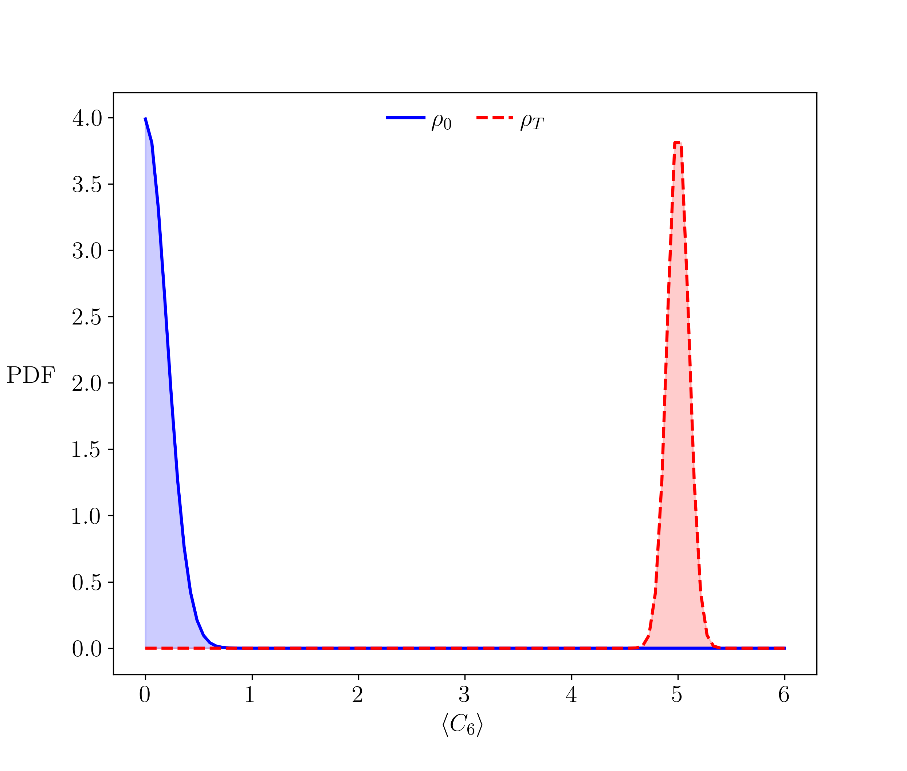
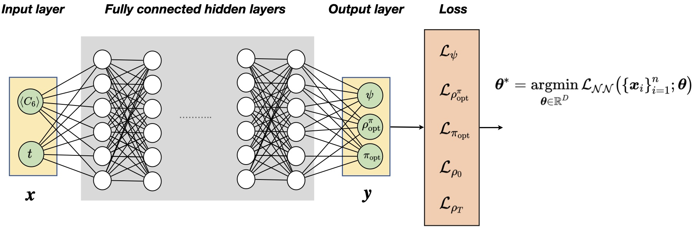
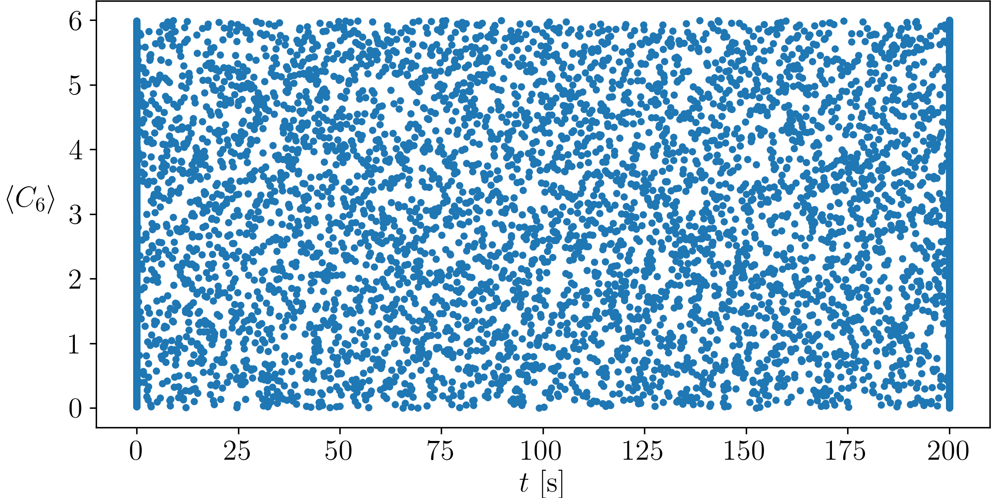
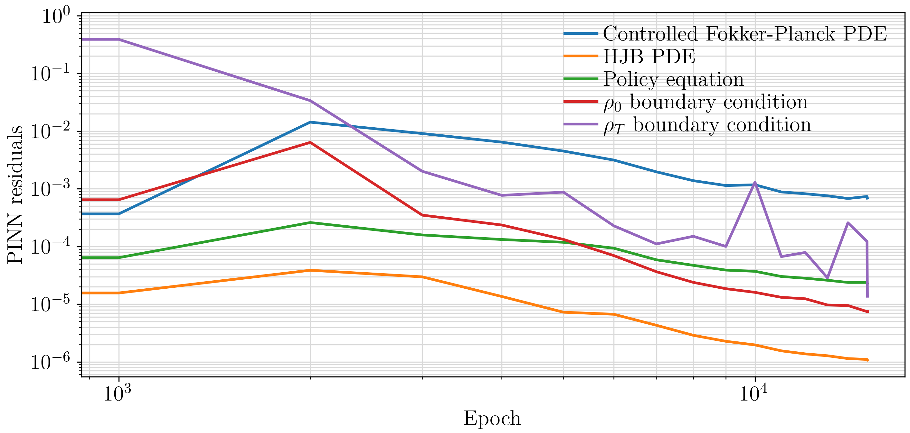
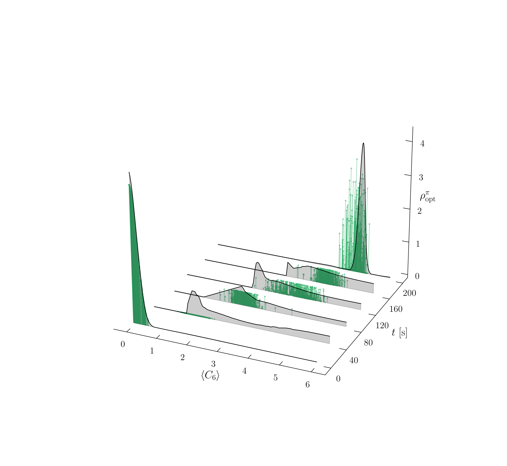

# PhysicInformedDeepLearningColloidalControl

This repository contains the simulation files for the paper:

**I. Nodozi, J. O'Leary, A. Mesbah, and A. Halder, "A Physics-informed Deep Learning Approach for Minimum Effort Stochastic Control of Colloidal Self-Assembly,"**  presented at ACC 2023.

In this work, we formulate the finite-horizon stochastic optimal control problem for colloidal self-assembly in the space of probability density functions (PDFs) of the underlying state variables (namely, order parameters). The control objective is to steer the state PDFs from a prescribed initial probability measure towards a prescribed terminal probability measure with minimum control effort.



Controlled self-assembly process is used in precision (e.g., sub nm scale) manufacturing of materials with advanced electrical, magnetic, or optical properties.


The prescribed initial PDF $\rho_0$ (solid line) at the initial time $t=0$, and the prescribed terminal PDF $\rho_{T}$ (dashed line) at the final time $t=T$. Both PDFs are supported over $[0,6]$, which is the range of values for the state variable $\langle C_6\rangle$ denoting a crystallinity order parameter. In particular, $\langle C_6\rangle \approx 0$ implies a disordered state and $\langle C_6\rangle \approx$ 5-6 implies a highly ordered state.


The architecture of the physics-informed neural network with the system order parameter and time as the input features $\mathbf{x}:=(\langle C_6\rangle, t)$. The output $\mathbf{y}$ comprises the value function, optimally controlled PDF, and optimal control policy.


Training data in the domain $\Omega =[0,6]\times[0,200]$. We choose 1000 training points at each of the initial ($t=0$ s) and terminal ($t=200$ s) times and another 5000 state-time points inside the domain $\Omega:=[0,6]\times[0,200]$.


After 15,000 training epochs, the residuals for all loss functions go below $10^{-3}$.


Snapshots of the optimally controlled joint PDFs steering the order parameters distribution from the given initial distribution to the given terminal distribution over the given time horizon $[0,T]\equiv [0,200]$ s subject to the controlled noisy nonlinear sample path dynamics. The solid black curves with grey-filled areas are obtained from the PINN. The stem plots are the KDE approximants of the optimally controlled PDF snapshots obtained from the closed-loop sample paths.


## Repository Contents

- **/code**: Contains the source code for the simulations.
- **/data**: Includes datasets obtained from the simulations.
- **/results**: Directory for storing the figures.

## Requirements

The Jupyter notebook provided in this repository includes the following Python libraries:
- deepxde
- numpy
- scipy
- math
- matplotlib


## Usage

1. Clone the repository:

```bash
git clone https://github.com/inodozi/PhysicInformedDeepLearningColloidalControl.git
cd ColloidalSelfAssemblyControl
```
2. Navigate to the notebooks directory and open the Jupyter notebooks to explore the simulations:


```bash
jupyter notebook
```

3. Run the provided scripts in the directory to reproduce the results.

## Citation

If you find this repository useful in your research, please consider citing our paper:
```bash
@inproceedings{nodozi2023physicsinformed,
  title={A Physics-informed Deep Learning Approach for Minimum Effort Stochastic Control of Colloidal Self-Assembly},
  author={Nodozi, I. and O'Leary, J. and Mesbah, A. and Halder, A.},
  booktitle={American Control Conference (ACC)},
  year={2023}
}
```
## Contact

For any questions or inquiries, please contact inodozi@ucsc.edu


